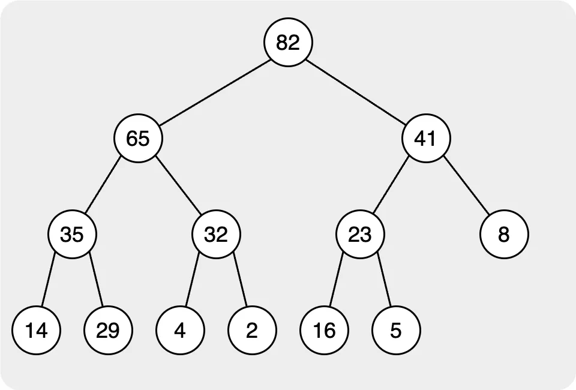
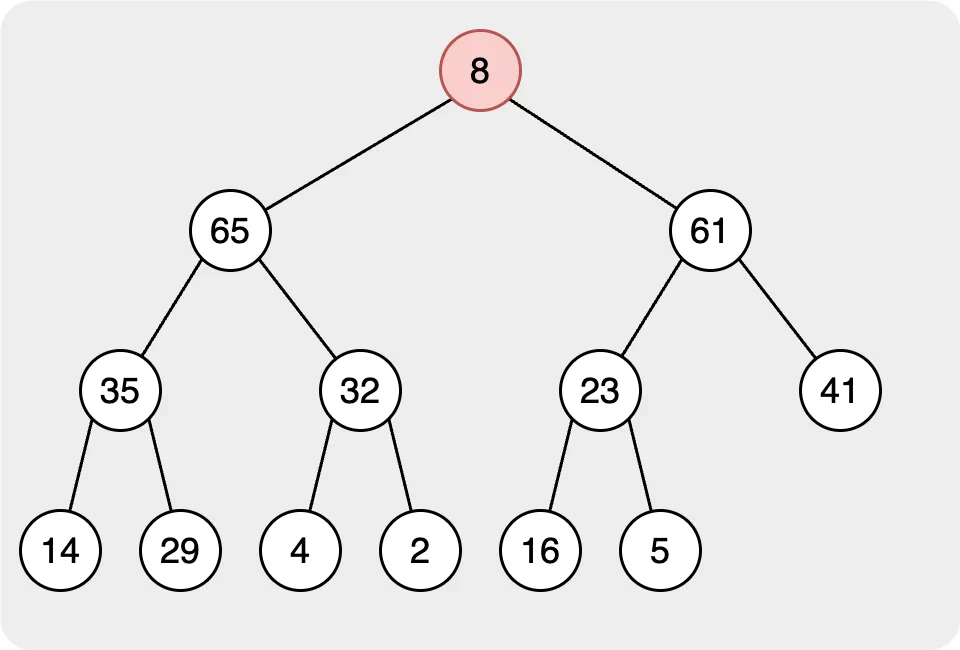
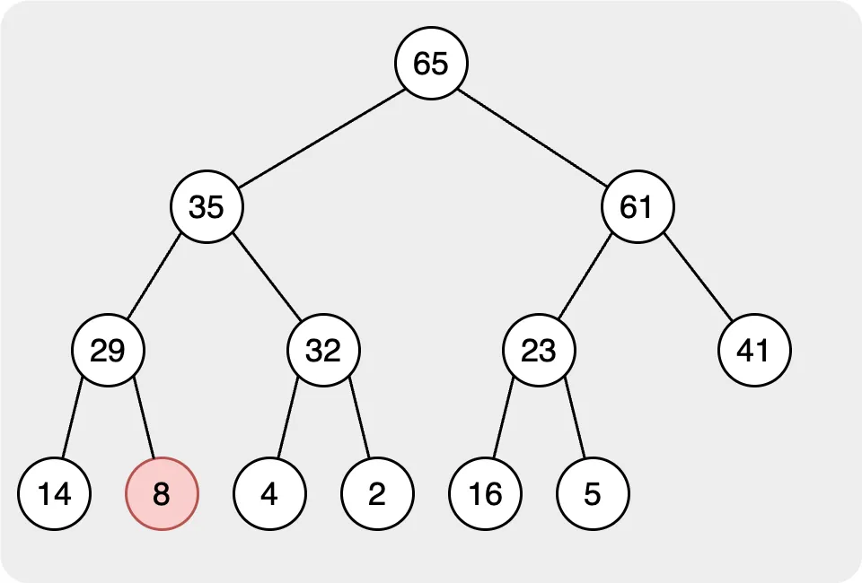

# 堆積 Heap

堆積使用「完全二元樹」來維護資料結構。在堆排序中，常見的堆排序有兩種：一種是「最小堆」，一種是「最大堆」。這兩個的方法是二元樹的根節點將是所有節點的最小值或最大值。

 

## 維護 Heap

下面將使用最大堆積 Max heap 進行演示。在 Heap 中，我們將重點關注兩個行為：插入和取出最大/最小。

### 插入 Insert

建立最大/最小堆積的第一步是將所有節點插入到堆中並使這些節點符合規則。在堆中，我們通常使用完全二元樹來維護資料結構，當有節點需要插入樹時，需要將其放在最後一層並左對齊。

將節點插入堆後，我們必須讓該節點遵循規則。在最大堆中，所有父節點的值都需要大於子節點的值。因此，我們需要將插入的節點值與其父節點進行比較。如果父節點的值小於子節點的值，我們需要切換它們。然後，繼續比較該值，直到根節點。

 

在上圖中，我們可以看到我們新增了值為 61 的節點。其次，我們需要讓我們新增的節點遵循最大堆的規則。我們需要讓父節點的值大於子節點的值。因此，我們開始計算新增到根的節點的值，如果子節點大於父節點，我們需要切換它們。最後，當我們檢查根節點時，你會發現堆中的所有節點都遵循規則。也意味著插入完成了。

### 取出 Pop

在最大/最小堆中，我們將使用 pop 來取得堆中的最大/最小節點。當我們刪除堆中的最大/最小節點後，將不再有根節點。所以，我們需要重新排列堆，讓它遵循堆的規則。

當我們想要刪除代表堆中最大/最小節點的根節點時，我們將移動最後一層的最左邊的節點作為根節點。然後重新排列堆。

 

第二步，我們需要找到根節點的正確位置。在此步驟中，我們將目標節點與其子節點進行比較。如果目標節點的值小於子節點的值，則與值最大的節點交換，然後繼續比較節點，直到所有節點都遵循規則。

  

直到所有目標節點及其子節點都遵循規則，我們完成彈出行為中的所有步驟。

## 堆積排序 Heap Sort

當我們知道什麼是堆之後，堆排序也是人們會使用的一種很常見的排序。因為在插入節點時建立堆，我們只花費 `O(logn)` 時間來重新排列堆。因此，堆排序的總時間將為 `O(nlogn)`。

當使用堆排序時，這意味著我們將所有未排序的數字放入堆中並建立最大/最小堆。要得到結果，只需按順序彈出節點，我們就可以得到排序後的數字。

## 堆積 Heap 的資料結構

正如我們上面講的，堆通常使用完全二元樹來維護堆。然而，在程式設計中，二元樹的實現和維護並不容易。為了方便維護，我們通常會將二元樹改為向量。為了將二元樹轉換為向量，首先我們需要取得所有節點的索引以及它們之間的關係。

在這種情況下，我們總是讓索引從1開始，在二元樹中，它會從根到葉，從左到右開始。因此，每個節點的索引將如下圖所示。

如上圖所示，左子節點的索引為 `2 * idx`，右子節點的索引為 `2 * idx + 1`；它可以幫助我們在使用向量時輕鬆找到子節點。那麼，如果我們想要取得父節點的 idx，它將是 `floor(idx / 2)`。這樣我們就可以利用索引非常快速的找到父節點或子節點。

## 堆積 Heap 在 C++

在理解堆的概念時，對於使用 C++ 的人來說，有一個 STL 容器供我們使用堆。本節我們將介紹如何在 C++ 中使用堆積。

在 C++ 中，`priority_queue` 是透過堆來實現的。預設情況下，如果我們只設定 **priority_queue** 的資料類型，它將設定為最大堆。**priority_queue** 的容器預設是向量。如果要將最大堆變更為最小堆，可以使用內建的 Compare 呼叫 `greater<T>` 將 **priority_queue** 設定為最小堆。

> Compare 參數被定義為，如果其第一個參數以弱順序出現在其第二個參數之前，則該參數會傳回 true。但由於優先權佇列首先輸出最大的元素，因此「排在前面」的元素實際上是最後輸出的。 - 參考 [cppreference.com](https://en.cppreference.com/w/cpp/container/priority_queue)

堆中常見的成員函數：

- `push()`: 插入元素並排序
- `pop()`: 刪除頂部元素
- `top()`: 存取最上面的元素
- `empty()`: 檢查 heap 是否為空
- `size()`: 取得 heap 的元素數量

> 如果您想設計比較函數，請查看 [cppreference.com](https://en.cppreference.com/w/cpp/container/priority_queue) 以了解詳細資訊。

{}
